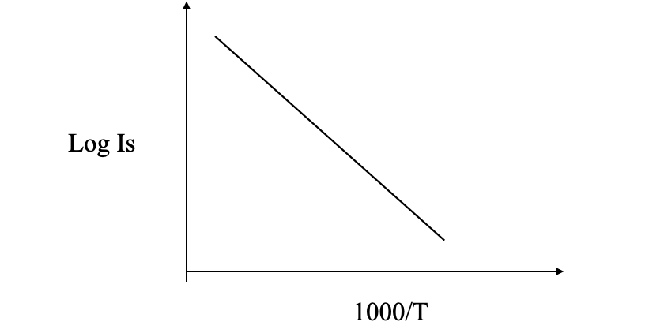

Trace the circuit switch on the training board.
Insert the thermometer provided with the unit into the opening of the Bakelite cap.

Now varying biasing voltage in step of 1V note that current. The current of
saturation current is at given temp.

Now switch on the oven & allow temperature rise up to 85oc. As temp. reaches this value switch off the oven. The temp. will rise up to 110o c & will become stable.

After some time temp will fall. Now fix the voltage at 5v & take the current
in the µA & temp. reading in Kelvin. 
          

Energy Band Gap Experiment Virtual Lab

## Observation Table

| Trial NO. | Temp in Celcius | Current Is (microAmp) | Temp in K (T) | 1000 / T | Log10(Is) |
|-----------|-----------------|-----------------------|---------------|----------|-----------|
| 1         |                 |                       |               |          |           |
| 2         |                 |                       |               |          |           |
| 3         |                 |                       |               |          |           |
| 4         |                 |                       |               |          |           |
| 5         |                 |                       |               |          |           |
| 6         |                 |                       |               |          |           |
| 7         |                 |                       |               |          |           |
| 8         |                 |                       |               |          |           |
| 9         |                 |                       |               |          |           |
| 10        |                 |                       |               |          |           |

**Formula:** Energy band gap (Eg) =  (Slope / 5.036 eV)

## Result

A graph is drawn between 103/T and log Is is drawn.

It is straight line & the slope is measuring the energy level gap .

The Energy Band Gap (Eg) for Germanium diode is ____________ eV.

