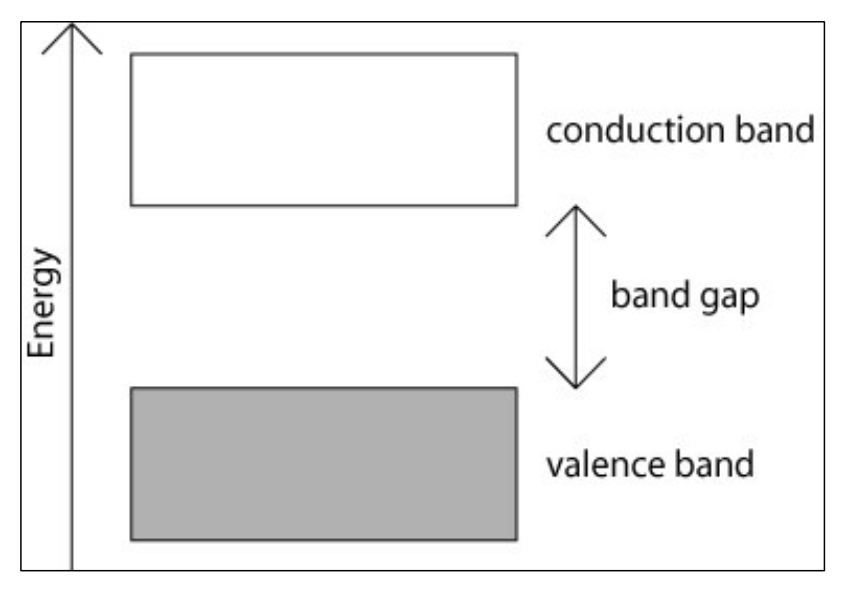
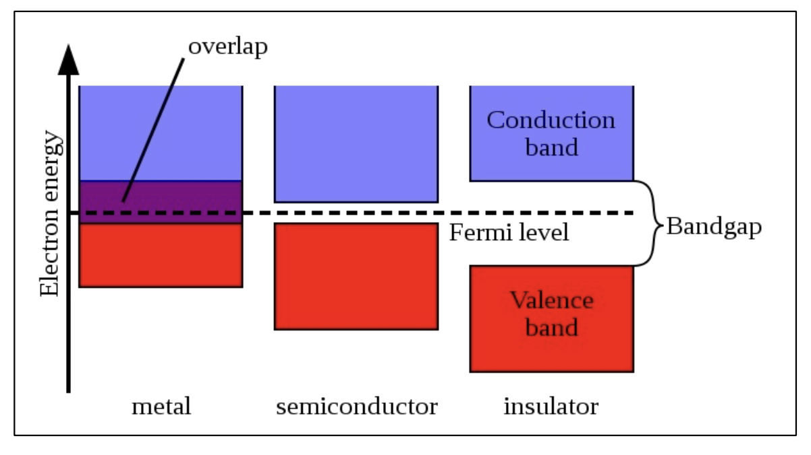

In semiconductor there is a energy gap (Eg) between the its conduction band & valance band. For conduction certain amount of energy is to be given to the electron so that goes from the valance band to the conduction band. The energy needed is the energy gap between 2 bands. When P-N junction is reverse biased the minority carrier concentration depends on the energy gap E1. The reverse current is (saturated value) is a function of temperature of the junction diode.

## Diagram

